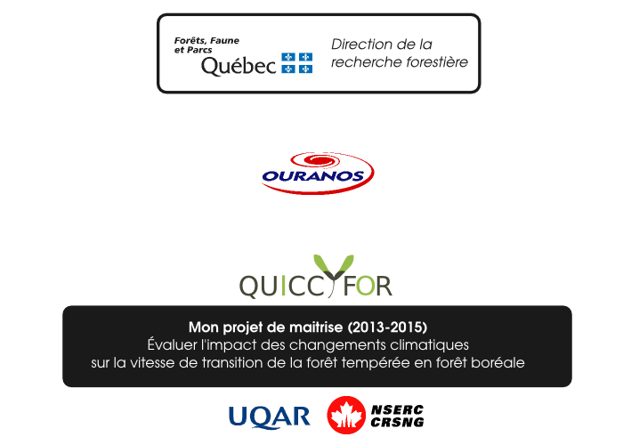
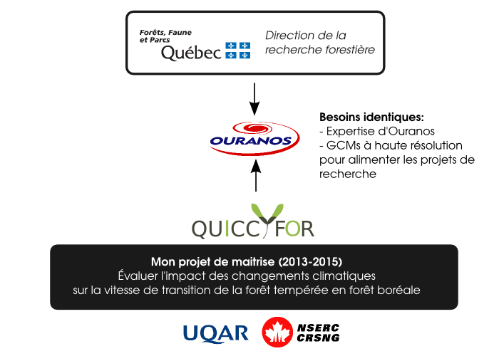
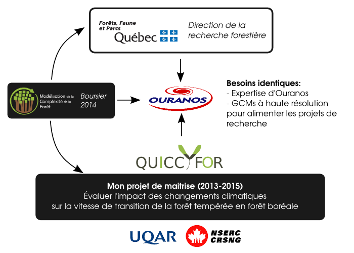
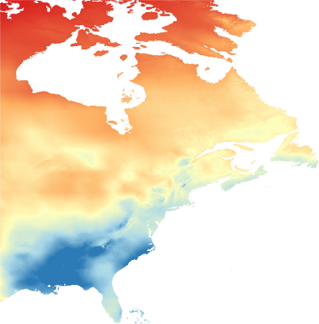
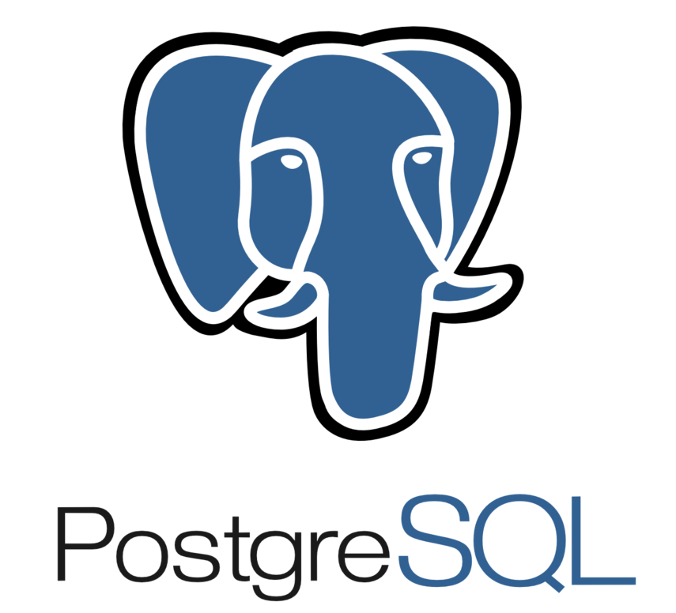
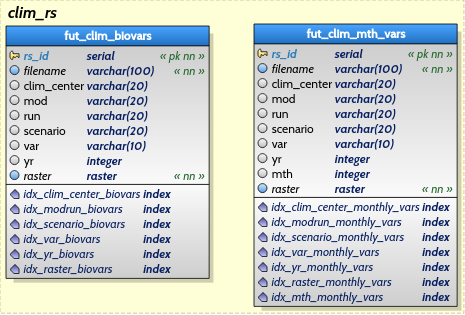
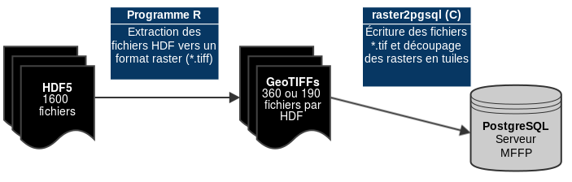
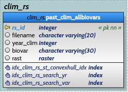
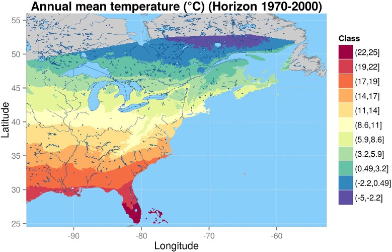

---
title       : Ouranos et PostgreSQL.
subtitle    : Vers un stockage spatialisé des GCMs à haute résolution?
author      : Steve Vissault
job         : Chaire de recherche du Canada en biogéographie et écologie des métacommunautés
framework   : io2012        # {io2012, html5slides, shower, dzslides, ...}
highlighter : highlight.js  # {highlight.js, prettify, highlight}
license: by-nc-sa
widgets: [bootstrap]
ext_widgets : {rCharts: [libraries/nvd3, libraries/leaflet]}
mode: selfcontained
hitheme: solarized_light


--- .segue .nobackground .dark

## Mise en contexte...

--- 

## Contexte de stage 

<div style='text-align: center;'>
    
</div>

--- 

## Contexte de stage 

<div style='text-align: center;'>
    
</div>

--- 

## Contexte de stage

<div style='text-align: center;'>
    
</div>

--- 

## Identification et réponse aux besoins 

### **Objectif:**

>Stocker les sorties climatiques d'Ouranos (Fichier Matlab/HDF5) dans une base de données spatialisée pour l'Est de l'Amérique du Nord.

> -**Données mensuelles pour 3 variables climatiques**: 570 240 grilles

> -**Données annuelles pour 19 biovariables climatiques**: 300 960 grilles

### **Un stage en trois volets...**

>0. Étude de faisabilité: Stockage et requêtes des grilles climatiques dans PostgreSQL (Automne 2014)
>1. Conceptualiser et réaliser la base de données spatialisée dans PostgreSQL (Hiver 2015)
>2. Créer un programme d'importation performant des fichiers HDFs (sorties climatiques d'Ouranos) vers la nouvelle base de données (Hiver 2015)

--- 

## La couverture spatiale...

<div style='text-align: center'>
    
</div>

--- .segue .nobackground .dark

## Qu'est-ce que PostgreSQL?


--- &twocol

## Qu'est-ce que PostgreSQL? 


*** =left

Un Système de Gestion de Base de données (SGBD) gratuit et openSource depuis 1989, composé de:

>- **Tables**: Comprend des enregistrements
>- **Clés primaires**: Assure des enregistrement uniques
>- **Jointures**: Permet de créer des relations entre les tables
>- **Indexes**: Permet une recherche plus rapide
>- **Intégrités référentielles:** Garantie l'intégrité des données 


*** =right

<div style='text-align: center'>
    
</div>

--- 

## Volet 1: Conceptualisation de la base de données

Pour illustrer et comprendre, voici la base de données Ouranos:

<div style='text-align: center'>
    
</div>

>- Pour créer des champs (colonnes) de type raster, nous avons besoins de **l'extension PostGIS**...

--- .segue .nobackground .dark

## Qu'est-ce que PostGIS?

--- &twocol

## Qu'est ce que l'extension PostGIS ? 

*** =left

C'est une cartouche spatiale qui permet de stocker et de manipuler des objets spatiaux à l'intérieur de PostgreSQL.

**Deux types d'objets spatiaux:**

1. **Geometrique**
    + Polygones (Multi ou simple)
    + Lignes
    + Points (Multi ou simple)
2. **Raster/Grilles**

*** =right

<div style='text-align: center; margin-top:50px '>
    
</div>


--- &twocol

## Qu'elles sont les forces de PostGIS Raster? 

*** =left

**Avantages:**

>1. Indexation spatiale
>2. Stockage des grilles en héxadecimale (Diminue le poids des grilles)
>3. Posséder des fonctions permettant de traiter spatialement ces objets nativement à l'intérieur de la base de données (p.ex. Clip, Insersection/Interception, Aggregation spatiale et temporelle)
>4. Puissance de calcul (avec opérations matricielles)

*** =right

<div style='text-align: center; margin-top:50px'>
    
</div>

--- .segue .nobackground .dark

## Volet 2: Importer les grilles climatiques...

--- 

## Des fichiers Matlab (HDF5) vers la base de données PostgreSQL...

L'importation se fait dans l'infrastructure de Colosse (Super-Calculateur de l'U-Laval).

<div style='text-align: center'>
    
</div>

Le programme raster2pgsql découpe chaque raster climatique en tuile de 38 x 20 pixels.

Les grilles ne sont pas stockées en multibandes.

--- 

## Des fichiers Matlab (HDF5) vers la base de données PostgreSQL...

Le programme et l'infrastructure permet de traiter **jusqu'à 24 fichiers Matlab à la fois**.

**Vitesse de traitement d'un fichier HDF par le programme R/raster2pgsql**:

- 12 minutes pour une importation des grilles mensuelles
- 30 minutes pour une importation des grilles annuelles

**Durée totale de l'importation:**

- 10-12 heures pour les grilles mensuelles 
- 24 heures pour les grilles annnuelles

--- .segue .nobackground .dark

## Sinon, ca ressemble à quoi dans la BD?

--- 

## Quelques chiffres après importation...

**Poids des indexes et tables:**

|                         Relation                         |         Poids (data)         | 
|----------------------------------------------------------|------------------------------|
| clim_rs.fut_clim_vars                                    | 358 GB (58 GB data)          |
| clim_rs.fut_clim_biovars                                 | 187 GB (30 GB data)          |
| clim_rs.idx_spatial_mth                                  | 6226 MB (index)              |
| clim_rs.idx_mod_run_mth                                  | 4983 MB (index)              |
| clim_rs.rs_pkey                                          | 4696 MB (index)              |
| clim_rs.idx_spatial_bio                                  | 3277 MB (index)              |
| clim_rs.idx_mod_run_bio                                  | 2622 MB (index)              |
-------------------------------------------------------------------------------------------

Table annuel avec 54 821 232 de lignes et mensuel avec 104 175 072 lignes


--- .segue .nobackground .dark

## Comment interroger cette BD?

--- 

## Le language SQL

On interroge une base de données en utilisant le language SQL (Stuctured Query Language). 
Il permet la manipulation des données via des instructions (`SELECT`, `INSERT`, `UPDATE`, `DELETE`...).


<div style='text-align: center; margin-top:50px'>
    
</div>


**Une requête simple**:

    SELECT rast, year_clim FROM clim_rs.past_clim_allbiovars 
    WHERE year_clim >= 1960 OR year_clim <=1970 AND biovar = 'annual_mean_temp';


--- 

## Exemple de requête de manipulation spatiale sur raster

**Aggregation temporelle:**

    SELECT ST_Union(rast,'MEAN') as tavg_6070, biovar FROM clim_rs.past_clim_allbiovars 
    WHERE year_clim >= 1960 OR year_clim <= 1970
    GROUP BY biovar;

Liste des fonctions sur raster disponible sur [postgis.net](http://postgis.net/docs/manual-2.1/RT_reference.html) 

--- .segue .nobackground .dark

## Comment accéder à cette BD ?


--- 

## Via pgAdmin3...

<div style='text-align: center'>
    
</div>

--- 

## Via une librairie (driver) dans son language préféré


```r
require(RPostgreSQL)

dbname <- "quicc_for_dev"
dbhost <- "localhost"
dbuser <- 'postgres'
dbport <- 5433
drv <- dbDriver("PostgreSQL")

# Connection à la base de données
con <- dbConnect(drv, host=dbhost, port=dbport, dbname=dbname,user=dbuser)

# Écriture de la requête
query_tmax_60 <- "
    SELECT * FROM clim_rs.past_clim_allbiovars 
    WHERE biovar = 'annual_maximum_temp' AND year_clim = 1960"

# Éxécution de la requête 
res <- dbGetQuery(con,query_tmax_60)
```

--- 

## Via une librairie (driver) dans son language préféré


```r
str(res)
```

```
## 'data.frame':	696 obs. of  5 variables:
##  $ rs_id    : int  2120847 2120870 2120878 2121336 2121307 2121308 2121309 2121310 2121311 2121312 ...
##  $ filename : chr  "1960_sg300_14.asc" "1960_sg300_14.asc" "1960_sg300_14.asc" "1960_sg300_14.asc" ...
##  $ year_clim: int  1960 1960 1960 1960 1960 1960 1960 1960 1960 1960 ...
##  $ biovar   : chr  "annual_maximum_temp" "annual_maximum_temp" "annual_maximum_temp" "annual_maximum_temp" ...
##  $ rast     : chr  "01000001001975ADBD4F55B53F1975ADBD4F55B5BF33A5F5B7040058C09DA223B9FCBF524000000000000000000000000000000000AD10000030001E004A003"| __truncated__ "01000001001975ADBD4F55B53F1975ADBD4F55B5BF226E4E2503005EC0AF0D15E3FC1F524000000000000000000000000000000000AD10000030001E004A003"| __truncated__ "01000001001975ADBD4F55B53F1975ADBD4F55B5BF39622D3E050056C0AF0D15E3FC1F524000000000000000000000000000000000AD10000030001E004A003"| __truncated__ "01000001001975ADBD4F55B53F1975ADBD4F55B5BF282B86AB03005CC0967D5704FF3F404000000000000000000000000000000000AD10000030001E004A003"| __truncated__ ...
```

--- 

## Visualiser dans R

<div style='text-align: center'>
    
</div>

--- .segue .nobackground .dark

## Les Geoserveurs...

--- 

## Qu'est ce qu'un géoserveur ?

> C'est un service (généralement) web fourni par un serveur et permettant à un client d'extraire des données spatialisées via les protocoles HTTP.

**Il en éxiste trois sortes:**

1. **Web Mapping Service (WMS):** Pour visualiser des vecteurs ou des grilles comme des images cartographiques (JPEG , PNG , TIFF)
2. **Web Feature Service (WFS):** Pour extraire des données géographiques dans diverses format (GeoJSON, KML, GML)
3. **Web Feature Service Transactional (WFS-T):** Permet d'interagir directement avec les base de données (édition des objets spatiaux envoyé par le serveur).

--- 

## La solution possible pour Ouranos

Selon le livre, *Postgis in Action (Obe et Hsu, 2011)*, ce qui est recommandé pour vos besoins (soit 1. Visualisation et 2. Extraction) est [MapServer](http://mapserver.org/), car il supporte toutes les extensions de PostGIS.

<div style='text-align: center; margin-top:50px'>
    
</div>

--- 

## Un Exemple de Web Mapping Service (WMS) via R/Leaflet


```r
require(rCharts)
require(knitr)
map1 = Leaflet$new()
map1$setView(c(52.731631, -70.156347), 4)
map1$tileLayer("http://{s}.tile.openstreetmap.se/hydda/base/{z}/{x}/{y}.png")
map1$set(width = 800, height = 550)
map1$save('maps/map1.html', cdn = TRUE)
```

--- 

<iframe data-src='maps/map1.html' seamless onload=lzld(this)></iframe>

--- 

## Connecter le Web Mapping Service (WMS) avec PostgreSQL

Un exemple avec le Bas-Saint-Laurent...


```r
query_climBSL <- "SELECT (ST_Intersection(rast,bsl.geom)).*, rs_id

FROM clim_rs.past_clim_allbiovars,
(SELECT geom FROM map_qc.regio_s WHERE res_nm_reg = 'Bas-Saint-Laurent') as bsl

WHERE year_clim=2010 AND biovar = 'annual_mean_temp'
AND ST_Intersects(rast,bsl.geom);"
```

--- 

<iframe data-src='maps/map2.html' seamless onload=lzld(this)></iframe>


--- 

### **Grille climatique de la température moyenne annuelle (°C) pour l'année 2010** 
(Bas-Saint-Laurent, interpolation par ANUSPLIN)

<iframe data-src='maps/map3.html' seamless onload=lzld(this)></iframe>

